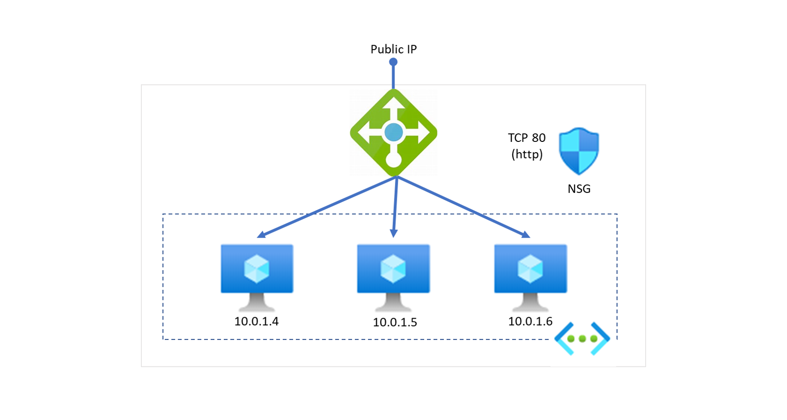

# Esempio: Load Balancer Deploy
Questo esempio prevede:

- La creazione di un Resource Group
- La creazione di un Azure Load Balancer
- La creazione di 3 VM Windows con IIS installato
- La modifica della pagina di default di IIS, inserendo il nome della VM ospite

 